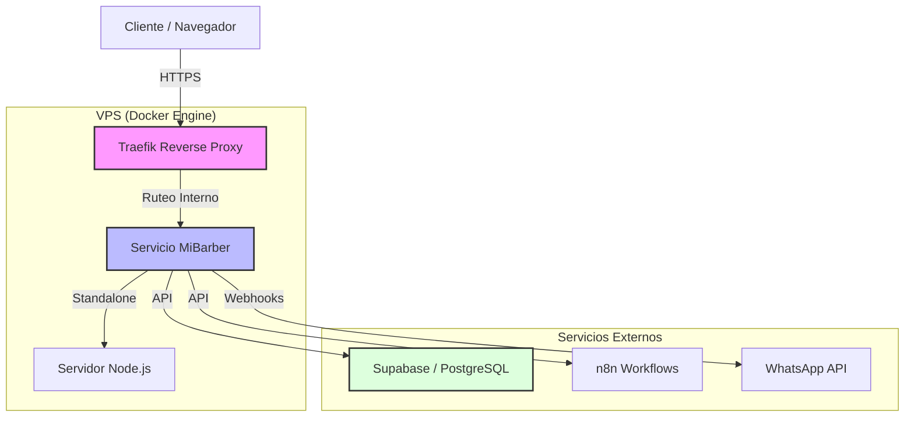

# Arquitectura de Despliegue en VPS - MiBarber

Este documento detalla la arquitectura, configuración y procesos de despliegue del sistema MiBarber en el Servidor Privado Virtual (VPS).

## 1. Resumen de la Arquitectura

La aplicación está construida con **Next.js** y se despliega utilizando **Docker** y **Docker Compose**. La infraestructura sigue un modelo de microservicios orquestado por **Traefik** como proxy inverso dinámico.



## 2. Componentes del Sistema

### 2.1 Docker Compose (`docker-compose.yml`)
El archivo de orquestación define cómo se ejecuta el contenedor de la aplicación.

*   **Imagen**: `mibarber:latest`
*   **Red**: Se conecta a una red externa llamada `codexanet`. Esto permite que Traefik (que reside en la misma red) detecte el contenedor.
*   **Traefik Labels**: Utiliza etiquetas de Docker para configurar automáticamente el SSL y el dominio:
    *   **Host**: `barberox.codexa.uy`
    *   **Entrypoints**: `websecure` (puerto 443) con TLS gestionado por Let's Encrypt.
    *   **Redirección**: Incluye middlewares para redirigir automáticamente todo el tráfico HTTP a HTTPS.

### 2.2 Dockerfile de Producción (`Dockerfile.prod`)
Utiliza un build multi-etapa para optimizar el tamaño de la imagen y la seguridad.

1.  **Stage 1 (deps)**: Instala solo las dependencias de producción.
2.  **Stage 2 (builder)**: Instala todas las dependencias, inyecta variables de entorno de build y ejecuta `npm run build`.
3.  **Stage 3 (runner)**: Crea la imagen final basada en la salida **standalone** de Next.js.
    *   Copia `.next/standalone` (el servidor mínimo necesario).
    *   Copia `.next/static` y `public` para servir archivos estáticos.
    *   Ejecuta `node server.js`.

### 2.3 Configuración de Next.js (`next.config.ts`)
La pieza clave para el despliegue eficiente es:
```typescript
output: 'standalone'
```
Esto genera un paquete que no depende de `node_modules` externos masivos, sino que incluye solo lo necesario dentro de la carpeta standalone.

## 3. Entorno y Variables

El sistema utiliza variables de entorno críticas definidas tanto en el build como en el runtime:

*   `NEXT_PUBLIC_SUPABASE_URL`: URL del proyecto Supabase.
*   `NEXT_PUBLIC_SUPABASE_ANON_KEY`: Clave pública de Supabase.
*   `SUPABASE_SERVICE_ROLE_KEY`: Clave de servicio para operaciones administrativas (solo servidor).
*   `PORT`: Por defecto `3000` internamente en el contenedor.

## 4. Proceso de Actualización (CI/CD Manual)

Actualmente, el despliegue se puede gestionar mediante el script `start-vps.sh` o siguiendo estos pasos en el VPS:

1.  **Construir la imagen**:
    ```bash
    docker build -f Dockerfile.prod -t mibarber:latest .
    ```
2.  **Levantar el servicio**:
    ```bash
    docker-compose up -d
    ```

## 5. Base de Datos y Servicios Externos

*   **Supabase**: Actúa como la base de datos PostgreSQL principal, sistema de autenticación y almacenamiento de archivos. Está alojado externamente (o en otro contenedor gestionado por el mismo VPS en `supabasecodexa.codexa.uy`).
*   **n8n**: Utilizado para automatizaciones de flujos de trabajo (agendamiento, notificaciones).
*   **Red Codexanet**: Es la red de infraestructura propia de Codexa donde conviven otros servicios y el balanceador de carga principal.

---
*Documentación generada el 11 de Abril, 2026 por Antigravity.*
