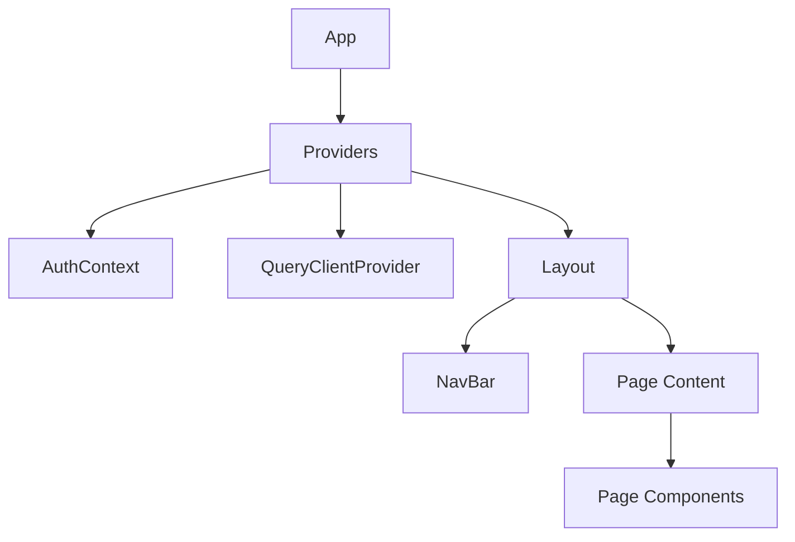
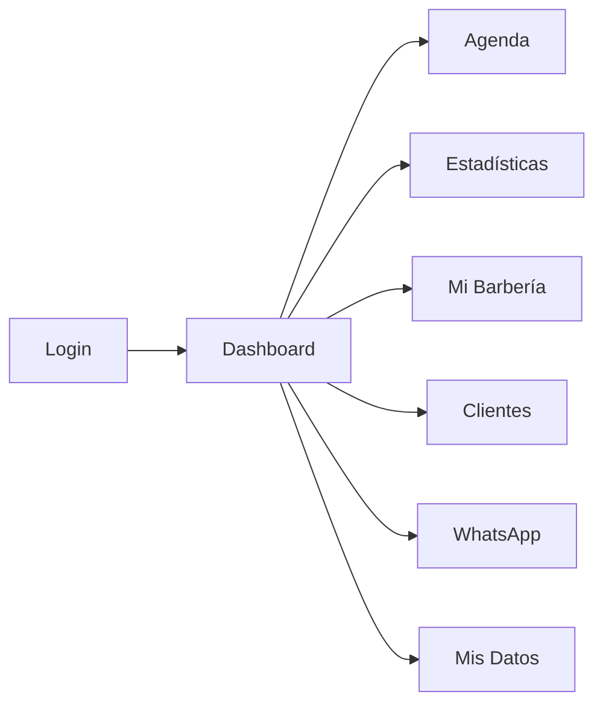

# 🗺️ MAPA DEL SISTEMA MiBarber

## 1. RESUMEN EJECUTIVO

### Métricas Generales
- **Total de archivos TypeScript/JavaScript**: 200+
- **Total de páginas/rutas**: 12
- **Total de componentes**: 150+
- **Total de hooks personalizados**: 40+
- **Total de líneas de código**: ~50,000 líneas aproximadamente
- **Stack tecnológico**: Next.js 15.5.3, React 19, TypeScript, Tailwind CSS, Supabase, TanStack Query, Zod

## 2. ARQUITECTURA DE CARPETAS

### Estructura Principal
```
src/
├── app/                    # Páginas y rutas de la aplicación (Next.js App Router)
├── components/             # Componentes reutilizables de la UI
├── features/               # Funcionalidades organizadas por dominio
│   ├── appointments/       # Gestión de citas
│   ├── auth/               # Autenticación y autorización
│   └── dashboard/          # Componentes del dashboard
├── hooks/                  # Hooks personalizados reutilizables
├── lib/                    # Librerías y utilidades compartidas
├── shared/                 # Recursos compartidos entre features
│   ├── types/              # Tipos TypeScript compartidos
│   └── utils/              # Utilidades compartidas
├── types/                  # Tipos de datos principales
└── utils/                  # Utilidades generales
```

### Convenciones de Organización
- **Patrón de features**: Organización por dominios de negocio
- **Separación de concerns**: Componentes, hooks, servicios y tipos claramente separados
- **Reexportación**: Uso de archivos index.ts para facilitar imports
- **Alias de importación**: Uso de `@/` para rutas absolutas

## 3. PÁGINAS Y RUTAS

### Página Principal (`/`)
- **Archivo**: [src/app/page.tsx](file:///c:/Users/Fito/Documents/APP/MiBarber/src/app/page.tsx)
- **Propósito**: Redirección basada en autenticación
- **Componentes Hijos**: Componente de carga
- **Hooks Usados**: useEffect, useRouter
- **Permisos**: Público

### Página de Inicio (`/inicio`)
- **Archivo**: [src/app/inicio/page.tsx](file:///c:/Users/Fito/Documents/APP/MiBarber/src/app/inicio/page.tsx)
- **Propósito**: Dashboard principal del usuario autenticado
- **Componentes Hijos**: [ProtectedDashboard](file:///c:/Users/Fito/Documents/APP/MiBarber/src/components/ProtectedDashboard.tsx), [AppointmentModalWithSucursal](file:///c:/Users/Fito/Documents/APP/MiBarber/src/components/AppointmentModalWithSucursal.tsx)
- **Hooks Usados**: [usePageTitle](file:///c:/Users/Fito/Documents/APP/MiBarber/src/hooks/usePageTitle.ts), [useCitas](file:///c:/Users/Fito/Documents/APP/MiBarber/src/hooks/useCitas.ts)
- **Estado Local**: useState para manejo de modales y citas seleccionadas
- **Permisos**: Usuarios autenticados

### Página de Login (`/login`)
- **Archivo**: [src/app/login/page.tsx](file:///c:/Users/Fito/Documents/APP/MiBarber/src/app/login/page.tsx)
- **Propósito**: Autenticación de usuarios
- **Componentes Hijos**: Formulario de login
- **Hooks Usados**: useState, useEffect, useRouter, [getSupabaseClient](file:///c:/Users/Fito/Documents/APP/MiBarber/src/lib/supabaseClient.ts)
- **Estado Local**: Manejo de credenciales, loading y errores
- **Permisos**: Público

### Página de Mi Barbería (`/mi-barberia`)
- **Archivo**: [src/app/mi-barberia/page.tsx](file:///c:/Users/Fito/Documents/APP/MiBarber/src/app/mi-barberia/page.tsx)
- **Propósito**: Configuración y gestión de la barbería
- **Componentes Hijos**: [AdminProtectedRoute](file:///c:/Users/Fito/Documents/APP/MiBarber/src/components/AdminProtectedRoute.tsx), múltiples modales de edición, secciones de gestión
- **Hooks Usados**: [useBarberiaInfo](file:///c:/Users/Fito/Documents/APP/MiBarber/src/hooks/useBarberiaInfo.ts), [useBarberoAuth](file:///c:/Users/Fito/Documents/APP/MiBarber/src/hooks/useBarberoAuth.ts), [useServiciosBarbero](file:///c:/Users/Fito/Documents/APP/MiBarber/src/hooks/useServiciosBarbero.ts)
- **Estado Local**: Manejo de modales, estados de edición
- **Permisos**: Solo administradores

### Página de Mis Datos (`/mis-datos`)
- **Archivo**: [src/app/mis-datos/page.tsx](file:///c:/Users/Fito/Documents/APP/MiBarber/src/app/mis-datos/page.tsx)
- **Propósito**: Gestión del perfil del usuario
- **Componentes Hijos**: [EditarBarberoModal](file:///c:/Users/Fito/Documents/APP/MiBarber/src/components/EditarBarberoModal.tsx)
- **Hooks Usados**: [useBarberoAuth](file:///c:/Users/Fito/Documents/APP/MiBarber/src/hooks/useBarberoAuth.ts), [useServiciosBarbero](file:///c:/Users/Fito/Documents/APP/MiBarber/src/hooks/useServiciosBarbero.ts)
- **Permisos**: Usuarios autenticados (no administradores)

### Página Protegida (`/protected`)
- **Archivo**: [src/app/protected/page.tsx](file:///c:/Users/Fito/Documents/APP/MiBarber/src/app/protected/page.tsx)
- **Propósito**: Vista principal del dashboard con Kanban
- **Componentes Hijos**: [KanbanBoardDndKit](file:///c:/Users/Fito/Documents/APP/MiBarber/src/components/KanbanBoardDndKit.tsx), [AppointmentModalWithSucursal](file:///c:/Users/Fito/Documents/APP/MiBarber/src/components/AppointmentModalWithSucursal.tsx), [CustomDatePicker](file:///c:/Users/Fito/Documents/APP/MiBarber/src/components/CustomDatePicker.tsx)
- **Hooks Usados**: [usePageTitle](file:///c:/Users/Fito/Documents/APP/MiBarber/src/hooks/usePageTitle.ts), [useBarberos](file:///c:/Users/Fito/Documents/APP/MiBarber/src/hooks/useBarberos.ts), [useSucursales](file:///c:/Users/Fito/Documents/APP/MiBarber/src/hooks/useSucursales.ts), [useCitas](file:///c:/Users/Fito/Documents/APP/MiBarber/src/hooks/useCitas.ts)
- **Estado Local**: Filtros de fecha, sucursal y barbero
- **Permisos**: Usuarios autenticados

### Página de Agenda (`/(main)/agenda`)
- **Archivo**: [src/app/(main)/agenda/page.tsx](file:///c:/Users/Fito/Documents/APP/MiBarber/src/app/(main)/agenda/page.tsx)
- **Propósito**: Visualización y gestión de citas en calendario
- **Componentes Hijos**: [AgendaBoard](file:///c:/Users/Fito/Documents/APP/MiBarber/src/features/appointments/components/AgendaBoard/index.tsx), [AppointmentModalWithSucursal](file:///c:/Users/Fito/Documents/APP/MiBarber/src/components/AppointmentModalWithSucursal.tsx)
- **Hooks Usados**: [usePageTitle](file:///c:/Users/Fito/Documents/APP/MiBarber/src/hooks/usePageTitle.ts), [useCitas](file:///c:/Users/Fito/Documents/APP/MiBarber/src/hooks/useCitas.ts), [useBarberos](file:///c:/Users/Fito/Documents/APP/MiBarber/src/hooks/useBarberos.ts), [useBarberiaInfo](file:///c:/Users/Fito/Documents/APP/MiBarber/src/hooks/useBarberiaInfo.ts), [useBarberoAuth](file:///c:/Users/Fito/Documents/APP/MiBarber/src/hooks/useBarberoAuth.ts), [useSucursales](file:///c:/Users/Fito/Documents/APP/MiBarber/src/hooks/useSucursales.ts)
- **Estado Local**: Filtros, modales, vista seleccionada
- **Permisos**: Usuarios autenticados

### Página de Estadísticas (`/(main)/estadisticas`)
- **Archivo**: [src/app/(main)/estadisticas/page.tsx](file:///c:/Users/Fito/Documents/APP/MiBarber/src/app/(main)/estadisticas/page.tsx)
- **Propósito**: Panel de estadísticas y métricas del negocio
- **Componentes Hijos**: [BarberoStatsView](file:///c:/Users/Fito/Documents/APP/MiBarber/src/components/BarberoStatsView.tsx), [AdminStatsView](file:///c:/Users/Fito/Documents/APP/MiBarber/src/components/AdminStatsView.tsx), [ExportarEstadisticas](file:///c:/Users/Fito/Documents/APP/MiBarber/src/components/ExportarEstadisticas.tsx)
- **Hooks Usados**: [useBarberoAuth](file:///c:/Users/Fito/Documents/APP/MiBarber/src/hooks/useBarberoAuth.ts), [usePageTitle](file:///c:/Users/Fito/Documents/APP/MiBarber/src/hooks/usePageTitle.ts), [useEstadisticas](file:///c:/Users/Fito/Documents/APP/MiBarber/src/hooks/useEstadisticas.ts)
- **Estado Local**: Período seleccionado
- **Permisos**: Solo administradores

### Página de Clientes (`/clientes`)
- **Archivo**: [src/app/clientes/page.tsx](file:///c:/Users/Fito/Documents/APP/MiBarber/src/app/clientes/page.tsx)
- **Propósito**: Gestión de clientes de la barbería
- **Componentes Hijos**: [ClientsTable](file:///c:/Users/Fito/Documents/APP/MiBarber/src/components/ClientsTable.tsx), [AdminProtectedRoute](file:///c:/Users/Fito/Documents/APP/MiBarber/src/components/AdminProtectedRoute.tsx)
- **Hooks Usados**: [usePageTitle](file:///c:/Users/Fito/Documents/APP/MiBarber/src/hooks/usePageTitle.ts)
- **Permisos**: Solo administradores

### Página de WhatsApp (`/whatsapp`)
- **Archivo**: [src/app/whatsapp/page.tsx](file:///c:/Users/Fito/Documents/APP/MiBarber/src/app/whatsapp/page.tsx)
- **Propósito**: Integración con WhatsApp para comunicación con clientes
- **Componentes Hijos**: [WhatsAppChat](file:///c:/Users/Fito/Documents/APP/MiBarber/src/components/WhatsAppChat.tsx)
- **Hooks Usados**: [usePageTitle](file:///c:/Users/Fito/Documents/APP/MiBarber/src/hooks/usePageTitle.ts)
- **Permisos**: Usuarios autenticados

### Página En Desarrollo (`/en-desarrollo`)
- **Archivo**: [src/app/en-desarrollo/page.tsx](file:///c:/Users/Fito/Documents/APP/MiBarber/src/app/en-desarrollo/page.tsx)
- **Propósito**: Página temporal para rutas en desarrollo
- **Componentes Hijos**: Mensaje de página en desarrollo
- **Hooks Usados**: useEffect, useRouter
- **Permisos**: Usuarios autenticados

### Página de Administración (`/admin`)
- **Archivo**: [src/app/admin/page.tsx](file:///c:/Users/Fito/Documents/APP/MiBarber/src/app/admin/page.tsx)
- **Propósito**: Configuración inicial del sistema
- **Componentes Hijos**: Formulario de configuración inicial
- **Hooks Usados**: useState, useRouter, [getSupabaseClient](file:///c:/Users/Fito/Documents/APP/MiBarber/src/lib/supabaseClient.ts)
- **Estado Local**: Formulario de configuración
- **Permisos**: Público (solo para configuración inicial)

## 4. COMPONENTES COMPLETOS

### Componentes Principales
1. **[AgendaBoard](file:///c:/Users/Fito/Documents/APP/MiBarber/src/features/appointments/components/AgendaBoard/index.tsx)** - Componente principal del calendario de citas
2. **[KanbanBoardDndKit](file:///c:/Users/Fito/Documents/APP/MiBarber/src/components/KanbanBoardDndKit.tsx)** - Tablero Kanban para gestión de citas
3. **[ClientsTable](file:///c:/Users/Fito/Documents/APP/MiBarber/src/components/ClientsTable.tsx)** - Tabla de gestión de clientes
4. **[WhatsAppChat](file:///c:/Users/Fito/Documents/APP/MiBarber/src/components/WhatsAppChat.tsx)** - Componente de chat con WhatsApp
5. **[ProtectedDashboard](file:///c:/Users/Fito/Documents/APP/MiBarber/src/components/ProtectedDashboard.tsx)** - Dashboard principal protegido
6. **[AdminStatsView](file:///c:/Users/Fito/Documents/APP/MiBarber/src/components/AdminStatsView.tsx)** - Vista de estadísticas para administradores
7. **[BarberoStatsView](file:///c:/Users/Fito/Documents/APP/MiBarber/src/components/BarberoStatsView.tsx)** - Vista de estadísticas para barberos
8. **[AppointmentModalWithSucursal](file:///c:/Users/Fito/Documents/APP/MiBarber/src/components/AppointmentModalWithSucursal.tsx)** - Modal para crear/editar citas

### Componentes de Formularios
1. **[EditarBarberoModal](file:///c:/Users/Fito/Documents/APP/MiBarber/src/components/EditarBarberoModal.tsx)** - Modal para editar datos de barbero
2. **[CrearBarberoModal](file:///c:/Users/Fito/Documents/APP/MiBarber/src/components/CrearBarberoModal.tsx)** - Modal para crear nuevos barberos
3. **[EditarSucursalModal](file:///c:/Users/Fito/Documents/APP/MiBarber/src/components/EditarSucursalModal.tsx)** - Modal para editar sucursales
4. **[EditarHorariosSucursalModal](file:///c:/Users/Fito/Documents/APP/MiBarber/src/components/EditarHorariosSucursalModal.tsx)** - Modal para editar horarios de sucursales

### Componentes de UI
1. **[NavBar](file:///c:/Users/Fito/Documents/APP/MiBarber/src/components/NavBar.tsx)** - Barra de navegación principal
2. **[MobileMenu](file:///c:/Users/Fito/Documents/APP/MiBarber/src/components/MobileMenu.tsx)** - Menú móvil responsive
3. **[UserDropdownMenu](file:///c:/Users/Fito/Documents/APP/MiBarber/src/components/UserDropdownMenu.tsx)** - Menú desplegable de usuario
4. **[CustomDatePicker](file:///c:/Users/Fito/Documents/APP/MiBarber/src/components/CustomDatePicker.tsx)** - Selector de fechas personalizado

## 5. HOOKS PERSONALIZADOS

### Hooks de Datos
1. **[useCitas](file:///c:/Users/Fito/Documents/APP/MiBarber/src/hooks/useCitas.ts)** - Gestión de citas con React Query
2. **[useBarberos](file:///c:/Users/Fito/Documents/APP/MiBarber/src/hooks/useBarberos.ts)** - Gestión de barberos
3. **[useClientes](file:///c:/Users/Fito/Documents/APP/MiBarber/src/hooks/useClientes.ts)** - Gestión de clientes
4. **[useServicios](file:///c:/Users/Fito/Documents/APP/MiBarber/src/hooks/useServicios.ts)** - Gestión de servicios
5. **[useSucursales](file:///c:/Users/Fito/Documents/APP/MiBarber/src/hooks/useSucursales.ts)** - Gestión de sucursales

### Hooks de Autenticación
1. **[useBarberoAuth](file:///c:/Users/Fito/Documents/APP/MiBarber/src/hooks/useBarberoAuth.ts)** - Estado de autenticación del barbero
2. **[useLogin](file:///c:/Users/Fito/Documents/APP/MiBarber/src/features/auth/hooks/useLogin.ts)** - Lógica de login

### Hooks de Estado
1. **[usePageTitle](file:///c:/Users/Fito/Documents/APP/MiBarber/src/hooks/usePageTitle.ts)** - Gestión del título de la página
2. **[useEstadisticas](file:///c:/Users/Fito/Documents/APP/MiBarber/src/hooks/useEstadisticas.ts)** - Cálculo de estadísticas
3. **[useDashboard](file:///c:/Users/Fito/Documents/APP/MiBarber/src/hooks/useDashboard.ts)** - Datos del dashboard

## 6. SERVICIOS Y APIs

### Clientes HTTP
- **Supabase Client**: Cliente principal para comunicación con la base de datos
- **[getSupabaseClient](file:///c:/Users/Fito/Documents/APP/MiBarber/src/lib/supabaseClient.ts)**: Función para obtener instancia del cliente de Supabase

### SDKs Externos
- **Supabase**: Para autenticación y base de datos
- **FullCalendar**: Para el calendario de citas
- **DnD Kit**: Para funcionalidad de drag and drop

### Configuraciones de API
- **Supabase Configuration**: Configuración de conexión a la base de datos
- **React Query Configuration**: Configuración de cache y estado

## 7. CONTEXTOS Y ESTADO GLOBAL

### Context Providers
1. **[AuthContext](file:///c:/Users/Fito/Documents/APP/MiBarber/src/components/Providers.tsx)** - Contexto de autenticación
2. **QueryClientProvider** - Contexto de React Query
3. **[Providers](file:///c:/Users/Fito/Documents/APP/MiBarber/src/components/Providers.tsx)** - Componente que agrupa todos los providers

### Estado Global
- **React Query**: Para gestión de estado del servidor
- **Context API**: Para estado de autenticación
- **useState/useReducer**: Para estado local de componentes

## 8. UTILIDADES Y HELPERS

### Funciones de Formato
1. **[formatCurrency](file:///c:/Users/Fito/Documents/APP/MiBarber/src/utils/formatters.ts)** - Formateo de valores monetarios
2. **[formatWhatsAppTimestamp](file:///c:/Users/Fito/Documents/APP/MiBarber/src/utils/formatters.ts)** - Formateo de timestamps para WhatsApp
3. **[getLocalDateString](file:///c:/Users/Fito/Documents/APP/MiBarber/src/utils/dateUtils.ts)** - Conversión de fechas a formato local

### Funciones de Validación
1. **AuthService** - Servicios de autenticación
2. **Validations** - Validaciones de formularios y datos

## 9. TIPOS Y INTERFACES

### Interfaces Principales
1. **[Appointment](file:///c:/Users/Fito/Documents/APP/MiBarber/src/types/db.ts#L3-L32)** - Representa una cita
2. **[Client](file:///c:/Users/Fito/Documents/APP/MiBarber/src/types/db.ts#L34-L54)** - Representa un cliente
3. **[Barbero](file:///c:/Users/Fito/Documents/APP/MiBarber/src/types/db.ts#L56-L71)** - Representa un barbero
4. **[Service](file:///c:/Users/Fito/Documents/APP/MiBarber/src/types/db.ts#L73-L84)** - Representa un servicio
5. **[CajaRecord](file:///c:/Users/Fito/Documents/APP/MiBarber/src/types/db.ts#L86-L102)** - Representa un registro de caja
6. **[Barberia](file:///c:/Users/Fito/Documents/APP/MiBarber/src/types/db.ts#L124-L129)** - Representa una barbería
7. **[Sucursal](file:///c:/Users/Fito/Documents/APP/MiBarber/src/types/db.ts#L131-L141)** - Representa una sucursal

## 10. FLUJOS DE DATOS PRINCIPALES

### Flujo de Autenticación
```
Usuario ingresa credenciales → 
Validación en useLogin → 
Consulta a Supabase → 
Creación de sesión (localStorage + cookies) → 
Actualización de AuthContext → 
Redirección a dashboard
```

### Flujo de Creación de Citas
```
Usuario abre modal de creación → 
Selección de datos (fecha, hora, cliente, servicio) → 
Validación de datos → 
Mutación con React Query → 
Inserción en Supabase → 
Invalidación de cache → 
Actualización de UI
```

### Flujo de Navegación
```
Usuario hace clic en enlace → 
Next.js Router cambia ruta → 
Carga de componente de página → 
Ejecución de hooks de datos → 
Renderizado de UI
```

## 11. DEPENDENCIAS REACT QUERY

### Query Keys Principales
- `["citas"]` - Lista de citas
- `["barberos"]` - Lista de barberos
- `["clientes"]` - Lista de clientes
- `["servicios"]` - Lista de servicios
- `["sucursales"]` - Lista de sucursales
- `["barberoAuth"]` - Estado de autenticación

### Mutations
- `createMutation` - Creación de entidades
- `updateMutation` - Actualización de entidades
- `deleteMutation` - Eliminación de entidades

## 12. DIAGRAMAS

### Árbol de Componentes Principal


### Flujo de Navegación
